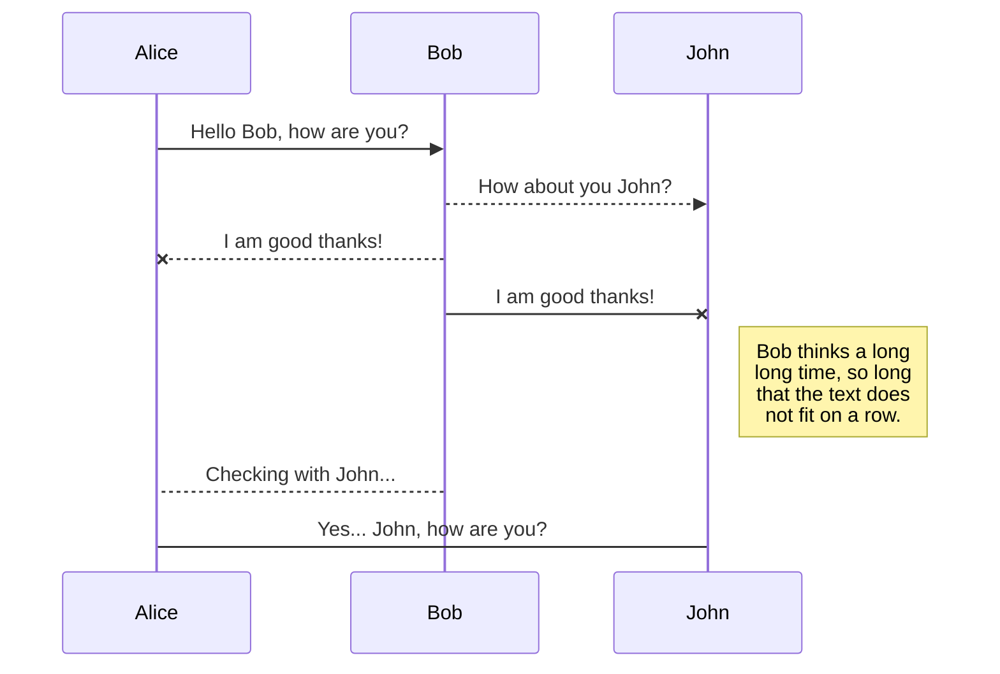
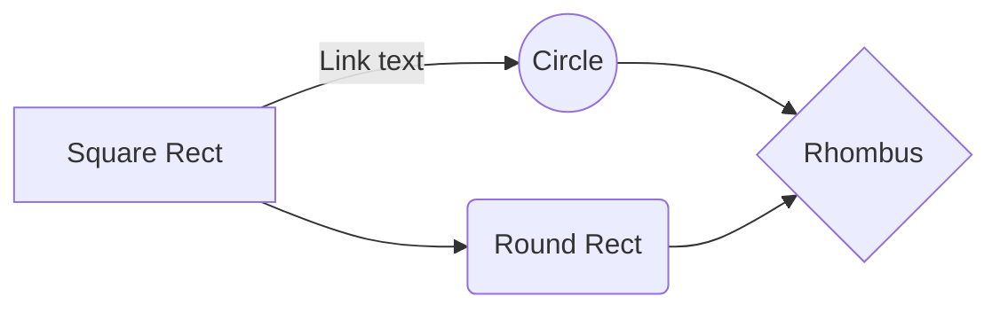

# A Gentle Introduction to Graph Neural Networks and their combinatorial opportunities

## GOAL

_We aim to present Graph Neural Networks (GNN) as an interesting research area and discuss some combinatorial intuitions involved in the design of the architecture of such networks, and in the analysis of the expressiveness and limitations of GNNs in solving hard computational problems_

## Summary

### Motivation (Why should you care?)

-   Machine Learning is being successfully applied to solve multiple problems and advance many research areas
-   Graphs provide a powerful representation of data for a broad range of domains: molecules, social networks, knowledge networks etc
-   There are many hard problems involving graphs which can’t be solved efficiently by any known algorithm
-   [Show examples of problems where GNN can/could be applied]
-   * Link prediction
-   * Node classification
-   * Graph classification (chemistry, biology)
-   * 3D Computer graphics
-   Hundreds of papers, most of them from 2017 up to now [https://github.com/thunlp/GNNPapers](https://github.com/thunlp/GNNPapers)

### Introduction to Machine Learning

-   In essence, the key idea, it's not that hard or new. For instance, Linear Regression is a kind of machine learning model
-   [Show example with Linear Regression]
-   There are many different models, but we are interested in a particular model called Perceptron — the basis for deep Learning

#### Perceptron

-   [Show Slides from MIT]: linear combination of **weight** and **bias** followed by non linearity

-   The idea is to simulate an artificial neuron
-   We can use multiple perceptrons together; if stacked together in layers, the output of one can be the input of another.
-   This way, we create an artificial neural network. The architecture is an N-partite graph.

### Neural Networks

-   [Explain how a neural network works]
-   *Forward pass
-   *Output evaluation (Loss)
-   *Backpropagation (Training, optimization)
-   Approximation Capabilities of Multilayer Feedforward Networks (Kurt Hornik, 1991)

-   Deep Neural Networks — why do we need to stack more layers?

**Some Networks Architectures Design Guidelines**

-   Dropout (overfitting)
-   Convolutional Neural Networks (CNN)
-   Auto-encoders

**Graph Neural Networks (GNN)**

-   Graph embedding problem: how to learn a Euclidean representation of graphs?
-

# Markdown extensions

StackEdit extends the standard Markdown syntax by adding extra **Markdown extensions**, providing you with some nice features.

> **ProTip:** You can disable any **Markdown extension** in the **File properties** dialog.

## SmartyPants

SmartyPants converts ASCII punctuation characters into "smart" typographic punctuation HTML entities. For example:

|                |ASCII                          |HTML                         |
|----------------|-------------------------------|-----------------------------|
|Single backticks|`'Isn't this fun?'`            |'Isn't this fun?'            |
|Quotes          |`"Isn't this fun?"`            |"Isn't this fun?"            |
|Dashes          |`-- is en-dash, --- is em-dash`|-- is en-dash, --- is em-dash|

## KaTeX

You can render LaTeX mathematical expressions using [KaTeX](https://khan.github.io/KaTeX/):

The *Gamma function* satisfying $\Gamma(n) = (n-1)!\quad\forall n\in\mathbb N$ is via the Euler integral

$$
\Gamma(z) = \int_0^\infty t^{z-1}e^{-t}dt\,.
$$

> You can find more information about **LaTeX** mathematical expressions [here](http://meta.math.stackexchange.com/questions/5020/mathjax-basic-tutorial-and-quick-reference).

## UML diagrams

You can render UML diagrams using [Mermaid](https://mermaidjs.github.io/). For example, this will produce a sequence diagram:

And this will produce a flow chart:

<!--stackedit_data:
eyJoaXN0b3J5IjpbMTg5NzQ1ODIwNl19
-->