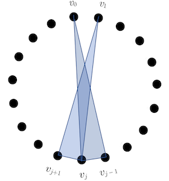

# Combinatorics Seminar
## Combinatorial Geometry
 Based on "Extremal problems for pairs of triangles in a convex polygon"
##### – Hallison Paz
December 11th 2020

---
# Convex Geometric Hypergraph

* A convex geometric hypergraph or cgh is a family of subsets of a set of points in strictly convex position in the plane
* We assume these points, denoted by $\Omega_n = {v_0, v_1, . . . , v_{n−1}}$, are the vertices of some regular n-gon with the clockwise cylic ordering $v_0 < v_1 < · · · < v_{n−1} < v_0$.
* Let the extremal function $ex_\circlearrowright(n,F)$ denote the maximum number of edges in an r-uniform cgh on n points that does not contain F – *an F-free cgh*
---
* We'll analyse the intersection patterns of pairs of triangles (r = 3)

----
# Two separated triangles, $M_1$ 
$$ex_\circlearrowright(n,M_1) = \triangle(n) + \frac{n(n-3)}{2}$$

where:

$$\triangle(n) = \bigg\{ \frac{(n+1)n(n-1)}{24}$$
---

# Warm up

* We start with two base constructions that will help us with configurations $M_1$ and $D_1$

---
# Construction 1 - $\mathcal{H}^*(n)$

**For $n ≥ 3$ odd**, let $\mathcal{H}^*(n)$ comprise the single cgh consisting of triangles which contain in their interior the centroid of $\Omega_n$. 

---
* There are i + 1 choices of $v′, v′′$ so that the shorter arc has exactly $i$ vertices of $\Omega_n$ in the interior, and $i ≤ n−3$.
* Summing over $i$ (and dividing by 3 because we count each triangle 3 times), we get that the number of triangles containing $x$ equals:

$$|\mathcal{H}^*(n)| = \frac{n}{3}(1 + 2 + ... + \frac{n-1}{2}) = \frac{(n+1)n(n-1)}{24} $$

---
**For $n ≥ 4$ even**, each $H \in \mathcal{H}^*(n)$ consists of all triangles which contain the centroid of $\Omega_n$ and, for each diameter $\{ v_i, v_{i+n/2}\}$ of $\Omega_n$, we either add all triangles $\{v_i, v_j, v_{i+n/2}\}$ where $v_i < v_j < v_{i+n/2}$, or all triangles $\{v_i, v_j, v_{i+n/2}\}$ where $v_{i+n/2} < v_j < v_i$.

---
* **If $n$ is even** then we do the same count, but first excluding the triangles with one side being the diameter of the circle. We get:
$$\frac{n(n-2)(n-4)}{24}$$

* Next, out of triangles with one side being the diameter exactly half of them contain $x$, which equals $\frac{n(n−2)}{4}$  Summing up, we get that the number of triangles containing x is 
$$|\mathcal{H}^*(n)| = \frac{n(n-2)(n-2)}{24}$$

---
* As no two triangles in any $H \in \mathcal{H}^*(n)$ have disjoint interiors, we have:

$$ex_\circlearrowright(n,\{M_1, S_1, D_1\}) \ge \triangle(n)$$

* Frankl, Holmsen and Kupavskii posed the following problem: *What happens if one relaxes the intersecting condition and allows triangles to intersect on the boundary?*
* One way to see it is we allow $S_1$ and $D_1$ and look for $ex_\circlearrowright(n,M_1)$

---
# Construction 2, $\mathcal{H}'(n)$
For $n \geq 3$ odd, the unique cgh in $\mathcal{H}'(n)$ is obtained by adding all triangles containing a pair $\{v_i,v_{i + (n - 1)/2}\}$ to any cgh in $\mathcal{H}^\star(n)$

---
For $n \geq 4$ even, $\mathcal{H}'(n)$ is obtained by adding all triangles containing a diameter of $\Omega_n$, plus all triangles
containing a pair from a set of $n/2$ pairwise intersecting pairs of the form $\{v_{i},v_{i+n/2-1}\}$ 

---
By inspection, every cgh in $\mathcal{H}'(n)$ is $M_1$-free, and has size $\triangle(n) + n(n-3)/2$.

---
# Two separated triangles $M_1$
### Theorem 1 (partial)

For all $n ≥ 3$, if $H$ is an extremal n-vertex $M_1$-free cgh, then $H ∈ \mathcal{H}'(n)$ and:

$$ex_\circlearrowright(n,M_1) = \triangle(n) + \frac{n(n-3)}{2}$$

--- 
# Proof of Theorem 1 (partial)

* Let n ≥ 3 be odd. 
* If $H \in H'(n)$ then we are done, so we may assume H contains a triangle $T(i, j, k) = {v_i, v_j, v_k}$ with $vi < v_j < v_k < v_{i+(n−1)/2}$. 
*  Moreover, we may assume that among all such triangles, $T(i, j, k)$ is the triangle where the longest edge ${v_i, v_k}$ is as short as possible. 

---
* Replace all triangles $T(i, j', k) \in H$ with $i < j' < k$ with all triangles $T(i − 1, k + 1, l)$ where j and l are on opposite sides of the edge ${v_i, v_k}$ 

---
* Since $T(i, j, k)$ and $T(i − 1, k + 1, l)$ form a copy of $M_1$, $T(i − 1, k + 1, l) \notin H$ for all such l. 
* Moreover, since $v_i < v_k < v_{i+(n−1)/2}$, the number of triangles $T(i − 1, k + 1, l)$ that we added is greater than the number of triangles $T(i, j, k)$ that we deleted. 
	* Note that none of $T(i-1, k+1, l)$ is in $H$, otherwise they would form a copy of $M_1$ with $T(i, j, k)$
* This produces a cgh $H'$ with $|H'| > |H|$. Since $H$ is extremal $M_1$-free, there exists a copy of $M_1$ in $H'$, which must contain a triangle $T(i − 1, k + 1, l) ∈ H'$

---
*  Since all triangles $T(i − 1, k + 1, l)$ intersect, the other triangle in the copy of M1 must be $T(f, g, h) \in H$. 
* Since $H$ is $M_1$-free, $T(f, g, h)$ intersects $T(i, j, k)$, which implies $v_i ≤ v_f < v_g < v_h ≤ v_k$ and $\{v_f, v_h\} \ne \{v_i, v_k\}$. 
* However, then the edge $\{vf, vh\}$ is shorter than the edge $\{vi, vk\}$, a **contradiction**.

---
* Now let $n \geq 4$ be even and let $H$ be an extremal $n$-vertex $M_1$-free cgh. If $H \in \mathcal{H}'(n)$ we are done, so suppose $H \not \in \mathcal{H}'(n)$. 
* If $H$ contains a triangle $T(i,j,k)$ where $v_i < v_j < v_k < v_{i + n/2 - 1}$, then we repeat the same proof as in the case $n$ is odd to derive a contradiction.
* Therefore all triangles in  $H$ contain the centroid or are $T(i,j,k)$ with $v_i < v_j < v_k = v_{i + n/2 - 1}$. 
* The pairs $\{v_i,v_{i + n/2 - 1}\}$ for which there exists such a triangle $T(i,j,k)$ must pairwise intersect (possibly at their endpoints) otherwise we find a copy of $M_1$ in $H$. In particular, by definition of Construction 2, $H \in \mathcal{H}'(n)$.

---
# Tangent Triangles $D_1$

### Theorem 3: 
* Let $n \geq 3$. Then the maximum over all sets of $n$ points in the plane, no three collinear, of the size of a $D_1$-free family of triangles spanned by the points is $\triangle(n)$.
* Then, for $n \ge 3$: 
  
  $$ex_\circlearrowright(n, D_1) \le \triangle(n)$$
---
# Tangent Triangles $D_1$
* Since $H \in H ^* (n)$ is $D_1$-free, we know $ex_\circlearrowright(n, D_1) \ge \triangle(n)$
* With theorem 3, we have:
  
  $$ex_\circlearrowright(n, D_1) = \triangle(n)$$
---
# Proof of Theorem 3
* Let $P$ be a set of $n$ points in the plane with no three collinear, and let $H$ be a $D_1$-free family of triangles on $P$. 
  * In particular $\Omega_n$ is a set as above
* For every pair $\{ v_i, v_j \} \in \partial H$, there is an edge $\{ v_i, v_j, v_k \} \in H$ such that either $v_i<v_k<v_j$ or $v_i<v_j<v_k$. 
  * Both possibilities can't happen simultaneously! (copy of $D_1$).
  
--- 
* If $v_i<v_k<v_j$ then we orient $\{ v_i, v_j\}$ as $(v_i, v_j)$
* if $v_i<v_j<v_k$ then we orient $\{ v_i, v_j\}$ as $(v_j, v_i)$. 

  * This yields an orientation of $\partial H$. 
---
* The main observation is that there is no edge $\{ v_i, v_j, v_k\} \in H$ such that $\{v_i,v_j,v_k\}$ is not a directed triangle in the orientation. 

--- 
* If we have $(v_i, v_j)$ and $(v_i, v_k)$, where $v_i<v_j<v_k$
  * then there is $v_l$ with $v_i<v_l<v_j$ 
  * and triangle $\{v_i,v_{l},v_j\}$ together with $\{ v_i, v_j, v_k\}$ is  a copy of $D_1$.

---
# Tangent Triangles - $D_1$
* We conclude that $|H|$ is at most the number of directed triangles in an orientation of a subgraph of $K_n$ 
* Which was shown to be at most $T(n) = \triangle(n)$ as required (Moon, 1968).

---
# Maximum of directed triangles in a tournament

Consider a Tournament of n vertices

* For a vertex v with out-degree k, there are $k\choose 2$ transitive triangles starting at v and $$

---
# Finish PROOF DIRECTED TRIANGLES

---
# Crossing triangles, $M_3$
### Theorem 4:

For all $n \ge 3$,

$$ex(n,M_3) = {n \choose 3} - {n - 3 \choose 3}$$

--- 
# Crossing triangles, $M_3$

### A extremal construction (not unique):

* Take all ${n-1}\choose 2$ triples contating a fixed vertex $v_0$
* Add the set of all $(n-3)(n-3)$ triples which contain a pair of cyclically consecutive vertices of $\Omega_n$

---
# Crossing triangles, $M_3$

* For the proof of Theorem 4 for $M_3$, it is useful to consider ordered hypergraphs: the vertex set is $\Omega_n = \{v_0,v_1,\dots,v_{n-1}\}$ with the ordering $v_0 < v_1 < \dots < v_{n-1}$. 
* Let $ex_{\to}(n,M_3)$ denote the maximum number of triples in an ordered hypergraph not containing triples $\{v_i,v_j,v_k\}$ and $\{v_{i'},v_{j'},v_{k'}\}$ with $v_i < v_{i'} < v_j < v_{j'} < v_k < v_{k'}$
  * this is the ordered analog of $M_3$.

---
# Crossing triangles, $M_3$

The following theorem implies Theorem \ref{m3}, since $ex(n,M_3) = ex_{\to}(n,M_3)$:

### *Theorem 9*

Let $n \geq 7$, then:  

$$ex_{\to}(n, M_3)=  {n \choose 3} - {n - 3 \choose 3}$$

---
# Proof of theorem 9
* Let $H$ be an $M_3$-free ordered triple system with $n$ vertices. 
* The strategy is to use induction. *Easy to check on $n = 6$*

---
* Let $H_1$ consists of all $e \in H$ with $v_0,v_1 \in e$
  * $|H_1| \le n-2$
* let $H_2$ consists of all $e \in H$ with $v_0\in e$, $v_1\not\in e$ and $e - v_0 + v_1 \in H$
* Let $H_3$ be obtained from $H \backslash (H_1 \cup H_2)$ by merging the vertices $v_0$ and $v_1$.
  * $H_3$ is a $M_3$-free cgh with $n-1$ vertices
  * $|H_3| \le {n-1\choose 3} - {n-4\choose 3}$

  #### Let's bound $|H_2|$ !

---
# Bounding $|H_2|$
* Consider $G = \{\{u,v\} : \{v_0,u,v\} \in H_2\}$ 
    * this is the *link graph* of $v_0$ with vertex set $\{v_2,v_3,\dots,v_{n-1}\}$ with the natural ordering. 
* G doesn't have crossing edges (let's prove)
--- 
* Suppose two edges of $G$ cross --say $\{u,v\},\{w,x\} \in G$ with $u < w < v < x$
  * By definition of $H_2$ these edges are linked to $v_0$ and $v_1$ in H
  * As $v_0 < v_1 < u < w < v < x$, the triples $\{v_0, u,v\}$ and $\{v_1, w,x\}$ form a copy of $M_3$, a contradiction. 
  

---
* Therefore no two edges of $G$ cross 
  * Which implies $G$ is an outerplane graph with $n - 2$ vertices. 
  * $|G| \leq 2n - 7$, by Euler's Formula.
  * $|G| = |H_2|$ (we have a bijection)
* So, we can bound $|H|$:

$$|H| = |H_1| + |H_2| + |H_3| \leq (n - 2) + (2n - 7) + {n - 1 \choose 3} - {n - 4 \choose 3} = {n \choose 3} - {n - 3\choose 3}$$
--- 
# Stabbing triangles, $M_2$

### Theorem 5:
For all $n \geq 7$,

$$ex(n,M_2) = {n \choose 2} - 2$$

---
# Stabbing triangles, $M_2$

### A extremal construction
* Take all triples containing a fixed vertex
* Add all $n-3$ triples of three cyclically consecutive vertices.
  * This construction has ${n \choose 2} - 2$ triples

---
# Proof of Theorem 5

* Strategy is induction on $n$ for $n \geq 7$. 
  * When $n=7$, since cyclically consecutive triples $\{v_i,v_{i+1},v_{i+2}\}$ are never in $M_2$, we may assume these seven edges are in any $M_2$-free cgh. 
  * For the remaining twenty-eight triples, we create a graph with vertex sets consisting of these triples and form an edge if two of the triples form a copy of $M_2$. 
  * A computer aided calculation  then yields this graph has independence number $12$ and hence $ex(7,M_2) = 12 + 7 = \binom{7}{2}-2$.
--- 
# Proof of theorem 5 
* For the induction step, we plan to find two consecutive $u,v \in \Omega_n$ with degree at most three and whose common link graph $G_{u} \cap G_{v}$ has at most $n - 3$ edges.

--- 
# Definitions
 * Let $H$ be a maximal $M_2$-free cgh on $\Omega_n$, and $H' \subset H$ be the cgh after removing all consecutive triples $\{v_i,v_{i+1},v_{i+2}\}$. 
 * Let $d(v_i,v_j)$ be the length of the path on the perimeter of the polygon starting with $v_i$ and moving clockwise to $v_j$. 
 * For an edge $e = \{v_i, v_{i+1}, v_k\} \in H'$ -- we only consider such edges
    * let $\ell(e) = \min\{d(v_{i + 1},v_k),d(v_k,v_i)\}$.

--- 

## Lemma 6.1 (should be 5.1)
Let $H \subset \binom{\Omega_n}{3}$ be a maximal $M_2$-free cgh and $H'$ be as above. Then 
1. For consecutive $u,v \in \Omega_n$, $|G_{u} \cap G_{v}| \leq n - 3$ with equality only if $G_u \cap G_v$ is a star.
2. There exists $v_i \in \Omega_n$ such that the degree of $\{v_{i},v_{i + 1}\}$ is at most three in $H$.

---
# Proof Lemma 6.1 (1)
* We first prove (1) by showing $G_{u,v} := G_u \cap G_v$ does not contain a pair of disjoint edges 

--- 
* If $\{w,x\},\{y,z\}$ are disjoint edges in $G_{u,v}$:
  * if $v < w < x < y < z < u < v$ or $v < w < y < z < x < u < v$ -- this means that $\{w,x\},\{y,z\}$ do not cross 
    * then $\{u,w,x\},\{v,y,z\}$ form $M_2$. 

---
* If $\{w,x\},\{y,z\}$ are disjoint edges in $G_{u,v}$:
  * If on the other hand $v < w < y < x < z < u < v$ -- this means $\{w,x\}, \{y,z\}$ do cross
    * then $\{u,y,z\},\{v,w,x\}$ form $M_2$. 

--- 
* So $G_{u,v}$ has no pair of consecutive edges.
* It is a standard fact that the unique extremal graphs with at least four vertices and no pair of disjoint edges are stars, and therefore $G_{u,v}$ has at most $n - 3$ edges.
--- 
# Proof of Lemma 6.1 (2)

***[RECAP]: 
There exists $v_i \in \Omega_n$ such that the degree of $\{v_{i},v_{i + 1}\}$ is at most three in $H$.***
***[\RECAP]***

* Suppose every pair of consecutive vertices has degree at least four in $H$ and hence degree at least two in $H'$. (we seek a contradiction)

---
* We first show there exists $e \in H'$ with $\ell(e) \geq 3$. If not, then $\{v_i, v_{i + 1}, v_{i + 3}\} \in H'$ and $\{v_{i - 2}, v_i, v_{i + 1}\} \in H'$ for all $i$ and there are no other edges in $H'$. 
  * However, then $\{v_0, v_1, v_3\}  \in H'$ and $\{v_2, v_4, v_5\}  \in H'$ form $M_2$, a contradiction. 
  * So there exists $e \in H'$ with $\ell(e) \geq 3$.

---
* From all $e \in H'$ with $\ell(e) \geq 3$, pick $e$ so that $\ell(e) = j \geq 3$ is a minimum. 
* Suppose $e = \{v_0,v_1, v_{j + 1}\}$, so $\ell(e) = d(v_1,v_{j + 1})$ 
  * (the proof for $e$ of the form $\{v_{n - j}, v_0, v_1\}$ with $\ell(e) = j = d(v_{n-j},v_0) \geq 3$ will be symmetric)
* Then the pair $\{v_{j - 1},v_{j}\}$ has degree at least two in $H'$ 
  * so there are edges $f = \{v_h,v_{j-1},v_j\}$ and $g = \{v_k,v_{j-1},v_j\}$ in $H'$. 

---
* Then the pair $\{v_{j - 1},v_{j}\}$ has degree at least two in $H'$ 
  * so there are edges $f = \{v_h,v_{j-1},v_j\}$ and $g = \{v_k,v_{j-1},v_j\}$ in $H'$. 
  * If $j + 1 < k \leq n - 1$ or $j + 1 < h \leq n - 1$, then $f$ and $e$ or $g$ and $e$ respectively form $M_2$, a contradiction. 
  * So $0 \leq h,k \leq j - 3$, recalling $\{v_{j-2},v_{j-1},v_j\} \not \in H'$.

--- 
Now, as $h$ and $k$ are distinct, we may assume $h < k$:

$$ \ell(f) = d(v_h,v_{j-1}) > d(v_k,v_{j - 1}) \geq 2$$
and so: $\ell(f) \geq 3$. 
* On the other hand, since $0 \leq h < j - 1$,

$$\ell(f) = d(v_h,v_{j - 1}) < d(v_0,v_j) = \ell(e)$$

* Contradicting the choice of $e$. This final contradiction proves (2).

--- 

* Let $\{v_i,v_{i + 1}\}$ have degree at most three in $H$, as guaranteed by Lemma 5.1 part (2). 
* We contract the pair $\{v_i,v_{i+1}\}$ to a vertex $w$ to get a cgh $H_0$ with $n - 1$ vertices. 
  * Note $H_0$ is $M_2$-free
* Let $G = \{\{u,v\} : \{u,v,v_i\},\{u,v,v_{i+1}\} \in H \}$ be the common link graph of $v_i$ and $v_{i + 1}$.

--- 
# Lemma 6.2
Let $G$ be the common link graph of $v_i$ and $v_{i + 1}$. Then $|G| \leq n - 4$.

--- 
# Proof Lemma 6.2
* If neither of $\{v_{i-1},v_i,v_{i+2}\}$ or $\{v_{i-1},v_{i+1},v_{i+2}\}$ is in $H$, then $\{v_{i-1},w,v_{i+2}\} \not \in H_0$ and $|G| \leq n - 4$ follows from Lemma 6.1 part (1). So we assume $\{v_{i-1},v_i,v_{i+2}\} \in H$ or $\{v_{i-1},v_{i+1},v_{i+2}\} \in H$.

---
* Case 1 $\{v_{i-1},v_i,v_{i+2}\} \in H$. Suppose $G$ is a star with $n - 3$ edges, with center $v_k$  
* If $v_k \notin \{v_{i-1}, v_{i+2} \}$, then letting $v_j \notin \{ v_k,v_{i-1},v_i, v_{i+1}, v_{i+2} \}$, it follows that $\{v_i,v_j,v_k\}$ and $\{v_{i-1},v_{i},v_{i+2}\}$ form a copy of $M_2$. 

---
* Hence, we may assume that $v_k= v_{i-1}$ or $v_k= v_{i+2}$. Both of these cases are similar, so consider only the case $v_k=v_{i+2}$. We may assume that $\{ v_{i+3}, v_{i+4} \}$ has degree at least three. Then there is at least one triple which contains $\{ v_{i+3}, v_{i+4} \}$ of the form $\{v,v_{i+3},v_{i+4}\}$. If $v \in \Omega_n$ and $v_{i+4} < v < v_{i+1}$, then $\{v,v_{i+3},v_{i+4}\}$ and $\{v_{i+1},v_{i+2},v_{i+5}\}$ form $M_2$. If $v=v_{i+1}$, then $\{v,v_{i+3},v_{i+4}\}$ and $\{v_{i-1},v_i,v_{i+2}\}$ form $M_2$. So $G$ is not a star
with $n - 3$ edges, and Lemma 6.1 part (1) gives $|G| \leq n - 4$.

--- 

* Case 2. $\{v_{i-1},v_{i+1},v_{i+2}\}\in H$. In this case, a symmetric argument to that used for $\{v_{i-1},v_i,v_{i+2}\} \in H$ applies by reversing the orientation of $\Omega_n$.

--- 
* To complete the proof of $|H| \leq {n \choose 2} - 2$, we note by inspection that $H_0$ is also $M_2$-free. By induction, $|H_0| \leq {n - 1 \choose 2} - 2$.
* By Lemma 6.2, and recalling $d_H(v_i,v_{i + 1}) \leq 3$,
$$ |H| = |H_0| + |G| + d_H(v_i,v_{i + 1}) \leq {n - 1 \choose 2} - 2 + n - 4 + 3 = {n \choose 2} - 2. $$

This proves Theorem.

--- 
# Crossing triangles with a common vertex, $S_3$

### Theorem 6:
For all even $n \geq 4$,

$$ex(n,S_3) = \frac{n(n-2)}{2}$$

---
# Crossing triangles with a common vertex, $S_3$
### Theorem 6:
For all even $n \geq 4$,

$$ex(n,S_3) = \frac{n(n-2)}{2}$$

### A extremal construction (even n):

$$H_0 :=\{ \{v_{2i-1},v_{2i},v\} \in \binom{\Omega_n}{3} : 0 \leq i < n/2 \}.$$

---
# Crossing triangles with a common vertex, $S_3$ 

### A extremal construction (even n):

$$H_0 :=\{ \{v_{2i-1},v_{2i},v\} \in \binom{\Omega_n}{3} : 0 \leq i < n/2 \}.$$

---
# Crossing triangles with a common vertex, $S_3$ 

* Strategy: find graphs $G_i'$ and $G_i''$ for each vertex: 

$$3|H| = \sum\limits_{i=0}^{n-1}(|G_i'|+|G_i''|) $$

---
# Proof of Theorem 6
* Let $H \subset \binom{\Omega_n}{3}$ be a $S_3$-free cgh and $G_i$ be the link graph of $v_i$ in $H$.
* Let $G_i'$ comprise the edges of $G_i$ which consist of two consecutive vertices in $\Omega_n$
* and let $G_i'' = G_i \backslash G_i'$.

--- 
# Lemma 7.1 (should be 6.1)
Let $H \subset \binom{\Omega_n}{3}$ be a $S_3$-free cgh. For $0 \leq i \leq n - 1$, $|G_i''| \leq n - 3$.

--- 
# Proof of Lemma 7.1
* The graph $G_i''$ has no pair of crossing edges since $H$ is $S_3$-free. 

---
* We may assume $i = 0$. 
* If we add to $G_i''$ all $n - 2$ edges $\{v_j,v_{j+1}\}$ for $1 \leq j < n$: 
  * we obtain an outerplanar graph $G$ with $n - 1$ vertices
  * So $|G| \leq 2(n - 1) - 3 = 2n - 5$. 
  * Removing the $n - 2$ added edges gives $|G_i''| \leq n - 3$.

--- 
# Lemma 7.2
Let $H \subset \binom{\Omega_n}{3}$ be a $S_3$-free cgh. 
For each $i$ with $0 \leq i \leq n/2 - 1$, $|G_{2i}'| + |G_{2i+1}'| \leq n$.

--- 
# Proof Lemma 7.2
* We may assume $i = 0$. 
* Let $G$ denote the multigraph obtained by superimposing the graphs $G_0'$ and $G_1'$, so $|G| = |G_0'| + |G_1'|$. 
* Each component $C$ of $G$ is a path $P$ with some edges of multiplicity two. 
* If $\{v_{j-1},v_j\} \in P \cap G_0'$, then $\{v_j,v_{j+1}\} \not \in P \cap G_1'$, 
  * otherwise $\{v_0,v_j,v_{j+1}\},\{v_1,v_{j-1},v_j\}$ form $S_3 - contradiction. 

---
If all edges of $P$ are from $G_1'$ only, then $|C| = |P| = |V(C)| - 1$.
Otherwise, let $\{v_{j},v_{j+1} \}$ be the first edge  of $P$ in $G_0'$ in the clockwise direction. Then all edges of $P$ preceding $\{v_j,v_{j+1}\}$ are in $G_1'$ only,
and all edges of $P$ after $\{v_j,v_{j+1}\}$ are in $G_0'$ only, whereas $\{v_j,v_{j+1}\}$ might be in both $G_0'$ and in $G_1'$. Therefore at most one edge of $P$ has multiplicity two, and $|C| \leq |P| + 1 = |V(C)|$. If $C_1,C_2,\dots,C_r$ are the components of $G$, we conclude
$|G| = |C_1| + |C_2| + \dots + |C_r| \leq |V(C_1)| + |V(C_2)| + \dots + |V(C_r)| = |V(G)| = n$.

--- 

--- 
We now complete the proof of $ex(n,S_3) \leq n(n - 2)/2$, using the following identity:
$$
3|H| = \sum_{i = 0}^{n-1} (|G_i'| + |G_i''|) = \sum_{i = 0}^{n/2-1} (|G_{2i}'| + |G_{2i+1}'|) + \sum_{i = 0}^{n-1} |G_i''|.
$$

We apply Lemmas XXX and XXX to each term in the sums to obtain:
$$
3|H| \leq  \sum_{i = 0}^{n/2-1} n + \sum_{i = 0}^{n - 1} (n - 3) =  \frac{1}{2}n^2 + n(n - 3) = \frac{3}{2}n(n - 2).
$$

----

# Theorem 3 - extremal number of $D_1$

* Let n ≥ 3. Then the maximum over all sets of n points in the plane, no three collinear, of the size of a D1-free family of triangles spanned by the points is ·?(n).

---
* Let P be a set of n points in the plane with no three collinear, and let H be a D1-free family of triangles on P. 
* For every pair {vi, vj} ∈ ∂H, there is an edge {vi, vj, vk} ∈ H such that either vi < vk < vj or vi < vj < vk. 
  * Note that both possibilities cannot happen simultaneously since that would yield a copy of D1. 

FIGURA 6

* If vi < vk < vj then we orient {vi, vj} as (vi, vj) and if vi < vj < vk then we orient {vi, vj} as (vj, vi). 
  * This yields an orientation of ∂H. 

FIGURA 7

---
  * The main observation is that there is no edge {vi, vj, vk} ∈ H such that {vi, vj, vk} is not a directed triangle in the orientation. 
    * Indeed, if we have (vi, vj) and (vi, vk), where vi < vj < vk, then there is vl with vi < vl < vj and triangle {vi, vl, vj}. 
    * Together with {vi, vj, vk} we obtain a copy of D1. 
  * We conclude that |H| is at most the number of directed triangles in an orientation of a subgraph of $K_n$ which is at most $T(n)$ as required (Moon, 1968)